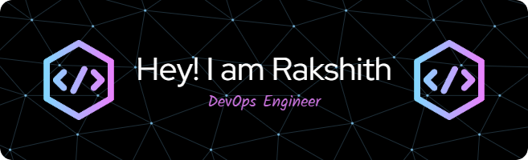

### Hi there 👋

- 👨‍💻 I’m currently working on optimizing CI/CD pipelines for a microservices architecture using Kubernetes and Helm charts for seamless deployment.
- 📚 I’m currently learning more about advanced container orchestration techniques and exploring best practices in infrastructure as code (IaC) with Terraform.
- 👯 I’m looking to collaborate on open-source projects related to automation tools, DevOps best practices, and improving deployment strategies for scalable applications.
- 🤔 I’m looking for help with fine-tuning monitoring and observability in Kubernetes clusters, especially around efficient log management and tracing.
- 💬 Ask me about setting up robust Jenkins pipelines, implementing Docker-based solutions, or automating infrastructure provisioning with Ansible.
- 😄 Pronouns: he/him
- ⚡ Fun fact: Always Learning, Always Exploring, Always Impacting

